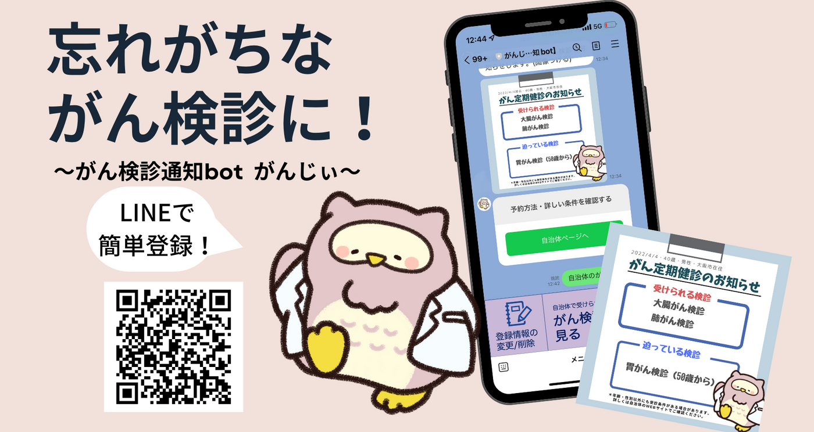
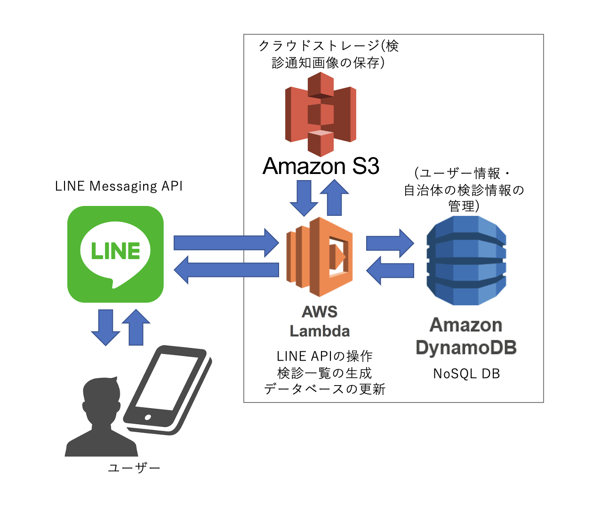

# がん検診を通知するLINE Bot "がんじぃ"
## Ganji -LINE Bot
父が癌を罹ったことをきっかけに、自治体実施のがん検診をお知らせするLINE bot「がんじぃ」を制作しました。自治体主催のがん検診は安価に受けられる一方、自治体によって受診対象の条件が異なり、また受診日を忘れやすいという問題があります。そこで本LINE botは生年月日・性別・自治体を登録することで、年に2度、受診可能ながん検診をお知らせします。2023年1月には大阪府後援のもとプレスリリースを発表しました。(テクノ愛2022 健闘賞)

After my father was diagnosed with cancer, I created a LINE bot called 'Ganjie' to inform people about cancer screening organised by local authorities. While cancer screening organised by local authorities is inexpensive, the conditions for eligibility differ from municipality to municipality and it is easy to forget the date of the screening. In January 2023, a press release was issued under the auspices of the Osaka Prefectural Government, and we are currently working on publicity activities. (Techno Ai 2022, Good Work Award)

5名の学生で取り組んでおり、現在大阪府にのみ対応しています。エリア拡大を検討中です。

Five students are working on this project together.
The database is only available in Osaka Prefecture. We are thinking about area expansion.

---
# System Overview

ユーザーがLINEアプリ上で検診情報を参照すると、AWS LamdaのAPIがDynamoDB内のユーザー情報・検診情報を参照し、受診可能な検診一覧を生成します。さらにその情報をS3内に保存されたテンプレート画像に加筆し、ユーザーに送信します。

When the user refers to the cancer check-up information on the LINE app, the AWS Lamda API refers to the user information and check-up information by local governments in DynamoDB and generates a list of available the check-ups he/she can access. The information is then added to a template image stored in S3 and sent to the user.

# To Do
Code for API on Lamda need refactoring. There are many duplication can cause error on future updates.